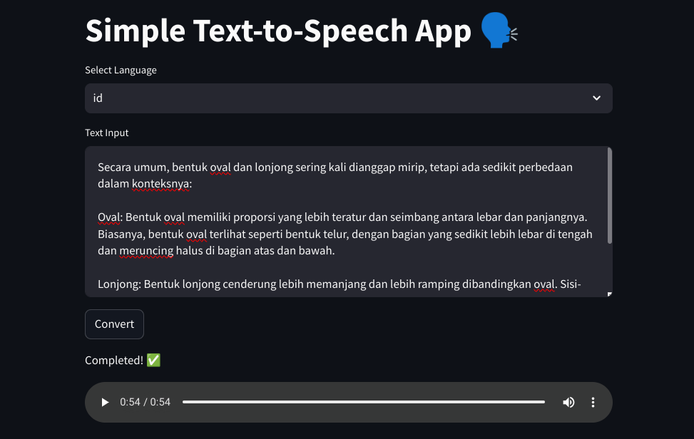

# simple-tts



A simple text-to-speech application using the [Google Text-to-Speech API](https://github.com/pndurette/gTTS) and Streamlit.

### Installation
1. Clone the repository
2. (Optional) Create a virtual environment and activate it
3. Install the required packages using this command:
```bash
pip install -r requirements.txt
```
4. Run the application using this command:
```bash
streamlit run app.py
```
